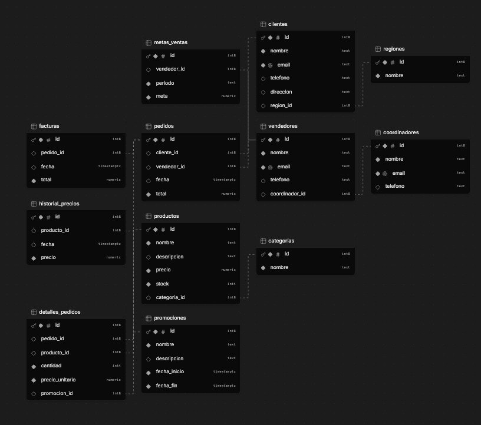

hacer un sistema ERP  

reglas

solo se va usar IA para el diseño de la pagina

backend se va conectar a una base de datos que se va crear en supabase 

el backend lo tengo que hacer sin IA ya que es una tarea importante

informacion 
 (base de datos)

Luis Guerra: He creado la estructura de la base de datos para un ERP de un mayorferretero, que incluye las siguientes tablas:

    Productos: Almacena información sobre los productos, incluyendo nombre, descripción, precio y stock.
    Vendedores: Contiene datos de los vendedores, como nombre, email y teléfono.
    Coordinadores: Similar a la tabla de vendedores, pero para los coordinadores.
    Clientes: Guarda información de los clientes, incluyendo nombre, email, teléfono y dirección.
    Pedidos: Registra los pedidos realizados, con referencias a clientes y vendedores, fecha y total del pedido.
    Detalles de Pedidos: Detalla los productos incluidos en cada pedido, con cantidad y precio unitario.
    Facturas: Almacena las facturas generadas para los pedidos, con fecha y total.

Estas tablas están relacionadas entre sí para facilitar la gestión de ventas y pedidos.
[13/6/2026 2:10 p. m.] Luis Guerra: He añadido una columna coordinador_id a la tabla de vendedores para establecer la relación de supervisión con los coordinadores. Ahora, cada vendedor puede tener un coordinador asignado como supervisor
[13/6/2026 2:11 p. m.] Luis Guerra: Para mejorar la visualización de la información en los KPI y gráficos, podemos agregar algunas tablas adicionales que capturen datos relevantes para el análisis. Aquí hay algunas sugerencias:

    Categorías de Productos: Para clasificar los productos y analizar las ventas por categoría.
    Regiones de Ventas: Para segmentar las ventas por ubicación geográfica.
    Metas de Ventas: Para establecer y seguir las metas de ventas de los vendedores o equipos.
    Historial de Precios: Para rastrear cambios en los precios de los productos a lo largo del tiempo.
    Promociones: Para gestionar y analizar el impacto de las promociones en las ventas.

Voy a proceder a crear estas tablas.
[13/6/2026 2:11 p. m.] Luis Guerra: He añadido las siguientes tablas para mejorar la visualización de datos en los KPI y gráficos:

    Categorías de Productos: Permite clasificar los productos y analizar las ventas por categoría.
    Regiones de Ventas: Segmenta las ventas por ubicación geográfica.
    Metas de Ventas: Establece y sigue las metas de ventas de los vendedores o equipos.
    Historial de Precios: Rastrea cambios en los precios de los productos a lo largo del tiempo.
    Promociones: Gestiona y analiza el impacto de las promociones en las ventas.

Estas tablas están relacionadas con las tablas existentes para facilitar el análisis y la generación de informes.
[13/6/2026 2:11 p. m.] Luis Guerra: -- Migrations will appear here as you chat with AI

create table productos (
  id bigint primary key generated always as identity,
  nombre text not null,
  descripcion text,
  precio numeric(10, 2) not null,
  stock int not null
);

create table vendedores (
  id bigint primary key generated always as identity,
  nombre text not null,
  email text unique not null,
  telefono text
);

create table coordinadores (
  id bigint primary key generated always as identity,
  nombre text not null,
  email text unique not null,
  telefono text
);

create table clientes (
  id bigint primary key generated always as identity,
  nombre text not null,
  email text unique not null,
  telefono text,
  direccion text
);

create table pedidos (
  id bigint primary key generated always as identity,
  cliente_id bigint references clientes (id),
  vendedor_id bigint references vendedores (id),
  fecha timestamp with time zone default now(),
  total numeric(10, 2) not null
);

create table detalles_pedidos (
  id bigint primary key generated always as identity,
  pedido_id bigint references pedidos (id),
  producto_id bigint references productos (id),
  cantidad int not null,
  precio_unitario numeric(10, 2) not null
);

create table facturas (
  id bigint primary key generated always as identity,
  pedido_id bigint references pedidos (id),
  fecha timestamp with time zone default now(),
  total numeric(10, 2) not null
);

alter table vendedores
add column coordinador_id bigint references coordinadores (id);

create table categorias (
  id bigint primary key generated always as identity,
  nombre text not null
);

alter table productos
add column categoria_id bigint references categorias (id);

create table regiones (
  id bigint primary key generated always as identity,
  nombre text not null
);

alter table clientes
add column region_id bigint references regiones (id);

create table metas_ventas (
  id bigint primary key generated always as identity,
  vendedor_id bigint references vendedores (id),
  periodo text not null,
  meta numeric(10, 2) not null
);

create table historial_precios (
  id bigint primary key generated always as identity,
  producto_id bigint references productos (id),
  fecha timestamp with time zone default now(),
  precio numeric(10, 2) not null
);

create table promociones (
  id bigint primary key generated always as identity,
  nombre text not null,
  descripcion text,
  fecha_inicio timestamp with time zone not null,
  fecha_fin timestamp with time zone not null
);

alter table detalles_pedidos
add column promocion_id bigint references promociones (id);